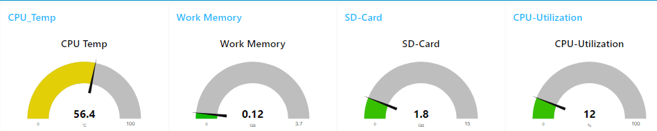

<div id="top"></div>

<!-- PROJECT SHIELDS -->
<!--
*** I'm using markdown "reference style" links for readability.
*** Reference links are enclosed in brackets [ ] instead of parentheses ( ).
*** See the bottom of this document for the declaration of the reference variables
*** for contributors-url, forks-url, etc. This is an optional, concise syntax you may use.
*** https://www.markdownguide.org/basic-syntax/#reference-style-links
-->
[![Contributors][contributors-shield]][contributors-url]
[![Forks][forks-shield]][forks-url]
[![Stargazers][stars-shield]][stars-url]
[![Issues][issues-shield]][issues-url]
[![License][license-shield]][license-url] 


<!-- PROJECT LOGO -->
<br />
<div align="center">
  <a href="https://github.com/GitAlex1/final_project-ressource_dashboard">
    
  </a>

<h3 align="center">Ressource Utilization Dashboard</h3>

  <p align="center">
    <a href="https://github.com/GitAlex1/final_project-ressource_dashboard"><strong>Explore the docs »</strong></a>
    <br />
    <br />
    <a href="https://github.com/GitAlex1/final_project-ressource_dashboard">View Demo</a>
    ·
    <a href="https://github.com/GitAlex1/final_project-ressource_dashboard/issues">Report Bug</a>
    ·
    <a href="https://github.com/GitAlex1/final_project-ressource_dashboard/issues">Request Feature</a>
  </p>
</div>


<!-- TABLE OF CONTENTS -->
<details>
  <summary>Table of Contents</summary>
  <ol>
    <li>
      <a href="#about-the-project">Project description</a>
      <ul>
        <li><a href="#built-with">Built With</a></li>
      </ul>
    </li>
    <li>
      <a href="#getting-started">Getting Started</a>
      <ul>
        <li><a href="#prerequisites">Prerequisites</a></li>
        <li><a href="#installation">Installation</a></li>
      </ul>
    </li>
    <li><a href="#usage">Usage</a></li>
    <li><a href="#roadmap">Roadmap</a></li>
    <li><a href="#contributing">Contributing</a></li>
    <li><a href="#license">License</a></li>
    <li><a href="#contact">Contact</a></li>
  </ol>
</details>


<!-- ABOUT THE PROJECT -->
## About The Project

The project is designed for a Raspberry Pi. The aim of the project is to equipp
the Pi with a handy ressource managment tool comparable to the Windows Task
manager. The actual version of the project provides a dashboard of the used
memory, hard disc storage, cpu utilization and cpu temperature

<p align="right">(<a href="#top">back to top</a>)</p>


### Built With

* [Node-RED](https://nodered.org/)
* [Node.js](https://nodejs.org/en/)

<p align="right">(<a href="#top">back to top</a>)</p>


<!-- GETTING STARTED -->
## Getting Started

The provided software should run on every Linux device. However it is only tested on a Raspberry Pi model 4.
So there is no guarantee for other devices

### Prerequisites

To clone this repository and use its functionalities it is necessary to install git.
* GIT
  ```sh
  sudo apt install git-all
  ```

### Installation

1. Clone the repo
   ```sh
   git clone https://github.com/GitAlex1/final_project-ressource_dashboard.git
   ```
2. Run installation script in the repository folder
   ```sh
   sudo ./install.sh
   ```

<p align="right">(<a href="#top">back to top</a>)</p>


<!-- USAGE EXAMPLES -->
## Usage

Start the dashboard by entering the following command
   ```sh
   node-red
   ```
After running the command the Raspberry will host the dashboard on port 1880. 
Example for accessing the dashboard:

IP-adresse raspberry: 172.172.137.232

Access the following link: 172.172.137.232:1880/ui

Stop the dashboard by using
   ```sh
   ctrl+c
   ```
If the tool is used very often, it can also be added to the autostart routine

<p align="right">(<a href="#top">back to top</a>)</p>


<!-- ROADMAP -->
## Roadmap

- [ ] Process overview
- [ ] Process killing mechanisms

See the [open issues](https://github.com/github_username/repo_name/issues) for a full list of proposed features (and known issues).

<p align="right">(<a href="#top">back to top</a>)</p>


<!-- CONTRIBUTING -->
## Contributing

If you have a suggestion for improvements, or if you want to implement the features on the roadmap, please fork the repo and create a pull request. 
You can also simply open an issue with the tag "enhancement".
Don't forget to give the project a star! Thanks!

1. Fork the Project
2. Create your Feature Branch (`git checkout -b feature/AmazingFeature`)
3. Commit your Changes (`git commit -m 'Add some AmazingFeature'`)
4. Push to the Branch (`git push origin feature/AmazingFeature`)
5. Open a Pull Request

<p align="right">(<a href="#top">back to top</a>)</p>


<!-- LICENSE -->
## License

Distributed under the MIT License. See `LICENSE.txt` for more information.

<p align="right">(<a href="#top">back to top</a>)</p>


<!-- CONTACT -->
## Contact

Alexander Hoppert  - alexanderhoppert@gmail.com

Project Link: [https://github.com/GitAlex1/final_project-ressource_dashboard](https://github.com/GitAlex1/final_project-ressource_dashboard)

<p align="right">(<a href="#top">back to top</a>)</p>


<!-- MARKDOWN LINKS & IMAGES -->
<!-- https://www.markdownguide.org/basic-syntax/#reference-style-links -->
[contributors-shield]: https://img.shields.io/github/contributors/GitAlex1/final_project-ressource_dashboard.svg?style=for-the-badge
[contributors-url]: https://github.com/GitAlex1/final_project-ressource_dashboard/graphs/contributors
[forks-shield]: https://img.shields.io/github/forks/GitAlex1/final_project-ressource_dashboard.svg?style=for-the-badge
[forks-url]: https://github.com/GitAlex1/final_project-ressource_dashboard/network/members
[stars-shield]: https://img.shields.io/github/stars/GitAlex1/final_project-ressource_dashboard.svg?style=for-the-badge
[stars-url]: https://github.com/GitAlex1/final_project-ressource_dashboard/stargazers
[issues-shield]: https://img.shields.io/github/issues/GitAlex1/final_project-ressource_dashboard.svg?style=for-the-badge
[issues-url]: https://github.com/GitAlex1/final_project-ressource_dashboard/issues
[license-shield]: https://img.shields.io/github/license/GitAlex1/final_project-ressource_dashboard.svg?style=for-the-badge
[license-url]: https://github.com/GitAlex1/final_project-ressource_dashboard/blob/main/LICENSE.txt
[product-screenshot]: images/screenshot.png
